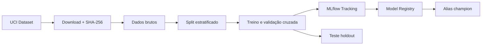

# Purchase Propensity MLOps Pipeline

[](https://github.com/claudiapark/fiap-tech-challenge-fase-2/actions/workflows/ci.yml)

Tech Challenge - Fase 2 da FIAP Pós-Tech Machine Learning Engineering. O projeto prevê se uma sessão de e-commerce terminará em compra e demonstra um ciclo de Engenharia de Machine Learning com Clean Code, `uv`, DVC, MLflow Tracking, Model Registry, Docker, testes e CI.

## Problema de negócio

Uma empresa de e-commerce precisa priorizar sessões com maior propensão de compra. O alvo `Revenue` indica se a sessão terminou em transação. O modelo apoia decisões como segmentação e abordagem comercial; não deve tomar decisões automáticas sobre pessoas.

## Dataset

Foi utilizado o [Online Shoppers Purchasing Intention Dataset](https://archive.ics.uci.edu/dataset/468/online+shoppers+purchasing+intention+dataset), disponibilizado pela UCI Machine Learning Repository sob licença CC BY 4.0 ([DOI 10.24432/C5F88Q](https://doi.org/10.24432/C5F88Q)).

- 12.330 sessões;
- 17 atributos comportamentais e contextuais;
- alvo binário `Revenue`;
- 15,47% de compras no treino e 15,49% no teste;
- arquivo validado por SHA-256 antes do uso.

## Arquitetura



O DVC coordena `download -> prepare -> train`. As transformações ficam dentro das pipelines Scikit-Learn para evitar vazamento entre validação e treino.

## Resultados

A classe positiva é minoritária; por isso, **PR-AUC de validação cruzada** foi definida como critério de seleção. O teste permaneceu isolado até a escolha do campeão.

| Modelo | CV PR-AUC | CV ROC-AUC | CV Recall | CV F1 |
|---|---:|---:|---:|---:|
| Regressão Logística | 0,6571 | 0,9044 | 0,7647 | 0,6169 |
| **Random Forest** | **0,7222** | **0,9275** | **0,8329** | **0,6691** |

Métricas finais da Random Forest no holdout:

| Accuracy | Precision | Recall | F1 | ROC-AUC | PR-AUC |
|---:|---:|---:|---:|---:|---:|
| 0,8637 | 0,5405 | 0,8037 | 0,6463 | 0,9190 | 0,7066 |

A Random Forest é registrada como `purchase-propensity-classifier` e recebe o alias `champion`. Os valores completos estão em [`reports/metrics.json`](reports/metrics.json).

## Estrutura

```text
.
├── .github/workflows/ci.yml
├── data/
│   ├── raw/
│   └── processed/
├── docs/
│   ├── ARCHITECTURE.md
│   ├── MODEL_CARD.md
│   └── VIDEO_STAR.md
├── models/
├── reports/metrics.json
├── src/purchase_propensity/
│   ├── data/
│   ├── modeling/
│   └── training/
├── tests/
├── Dockerfile
├── dvc.yaml
├── params.yaml
├── pyproject.toml
└── uv.lock
```

## Execução local

Pré-requisitos: Git, Python 3.12 e [`uv`](https://docs.astral.sh/uv/).

```bash
git clone https://github.com/claudiapark/fiap-tech-challenge-fase-2.git
cd fiap-tech-challenge-fase-2
python -m pip install uv
uv sync --locked
cp .env.example .env
uv run dvc repro
```

O dataset não precisa ser baixado manualmente. O estágio `download` obtém a versão oficial da UCI, confere o checksum fixado em `params.yaml` e deixa o DVC registrar os hashes em `dvc.lock`.

Comandos úteis:

```bash
uv run dvc dag
uv run dvc metrics show
uv run dvc repro
```

## MLflow Tracking e Model Registry

O pipeline usa SQLite como backend local porque o Model Registry requer um backend baseado em banco de dados.

Depois de executar `dvc repro`, inicie a interface:

```bash
uv run mlflow server \
  --host 127.0.0.1 \
  --port 5000 \
  --backend-store-uri sqlite:///mlflow.db \
  --default-artifact-root ./mlruns
```

Acesse <http://127.0.0.1:5000>. Em **Experiments**, compare as runs; em **Models**, abra `purchase-propensity-classifier` e confira o alias `champion`.

## Docker

```bash
docker build -t purchase-propensity:latest .
docker run --rm -p 5000:5000 purchase-propensity:latest
```

O contêiner reproduz o pipeline e inicia o MLflow em <http://127.0.0.1:5000>.

## Qualidade e testes

```bash
uv run ruff format --check .
uv run ruff check .
uv run pytest
```

A CI repete lint, 20 testes, cobertura mínima de 80%, `dvc repro` e build do Docker em pushes e pull requests.

## Configuração

Variáveis locais ficam no `.env`, nunca no Git. Os nomes e valores seguros estão em `.env.example`:

| Variável | Finalidade |
|---|---|
| `MLFLOW_TRACKING_URI` | backend de tracking e registry |
| `MLFLOW_EXPERIMENT_NAME` | experimento que agrupa as runs |
| `MLFLOW_REGISTERED_MODEL` | nome governado do modelo |
| `MLFLOW_MODEL_ALIAS` | alias da versão campeã |

## Limitações

- o dataset representa um recorte histórico e pode não refletir o comportamento atual;
- não há dimensão temporal suficiente para uma validação fora do tempo;
- o threshold padrão de 0,5 não foi otimizado por custos de negócio;
- as probabilidades ainda não foram calibradas;
- `PageValues` é muito informativa, mas sua disponibilidade precisa ser confirmada no instante real da decisão;
- linhas com atributos idênticos foram mantidas porque a base não possui identificador que prove duplicidade de sessão;
- o deploy em nuvem é opcional no desafio e não faz parte desta entrega.

Consulte o [Model Card](docs/MODEL_CARD.md) para detalhes de uso responsável.

## Documentação da entrega

- [Arquitetura e decisões](docs/ARCHITECTURE.md)
- [Model Card](docs/MODEL_CARD.md)
- [Roteiro do vídeo STAR](docs/VIDEO_STAR.md)
